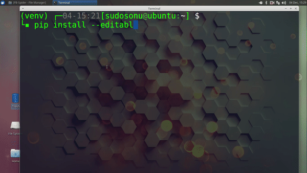

# FB-Spider 

 

A program which accepts the id of a Facebook page and transforms into a table of the latest 5 posts and the respective latest 5 comments per post. The table will be in .html format 

The number of posts and comments can be changed by editing the graph.py file.

# Table of contents

- [Get Started](#get-started)
- [Requirements](#requirements)
- [Instructions](#instructions)
- [Contribute](#contribute)

# Get Started

[(Back to top)](#table-of-contents)

You would require a Facebook developer account to get an access token : https://developers.facebook.com/

Register your app and replace the 'YOUR_ACCESS_TOKEN' in `graph.py` by your User Token : https://developers.facebook.com/tools/accesstoken/.

# Requirements

[(Back to top)](#table-of-contents)

Other than requiring Python3.x , you require the following libraries: 
* facepy 
* json 
* json2html 
* webbrowser 
* PyQt4 
* SIP 

# Instructions for the CLI Version

[(Back to top)](#table-of-contents)

1. Clone the repository to your machine.

2. Open your terminal and change directory to your cloned project folder.

3. `$ pip3 install --editable . ` This will install all the requirements listed.

4. Now run the program `$ python3 graph.py `

5. Enter the page name of the page you want to scrape. You see a display of 5 choices and then select one out. 

	Please note that this app will only work for public pages and not from profiles of other people.
	That would require permission from the user.
6. Enjoy the contents in a table format.
   A file called 'Table.html' would be made in the folder itself.
   You can open it and see the table.
   
# Instructions for the GUI Version

[(Back to top)](#table-of-contents)

For the GUI Version, follow the steps
1. Clone the repository to your local machine, open the terminal and change directory to your cloned project folder.
2. Use a virtual environment `virtualenv --python=python3.5 --no-site-packages venv` 
3. PyQt4 is not supported in Virtual Environment, so you need to setup PyQt manually in the `virtualenv`.
4. Two dependencies need to be downloaded,PyQt4 and SIP.
5. Download the binaries from the given website - (Choose the Source Packages)

    [PYQT4](https://www.riverbankcomputing.com/software/pyqt/download)  
    [SIP](https://www.riverbankcomputing.com/software/sip/download)
    
6. In the project folder, make a folder named build, and extract the PyQt4 and SIP, in the build folder.
7. Activate `virtualenv` using `. venv/bin/activate`
8. Install some prerequisites
   - `sudo apt-get install python2.7-dev libxext-dev python-qt4 qt4-dev-tools build-essential`
9. Go to build/SIP directory, and type the following commands:
   `python configure.py`
   `sudo make`
   `sudo make install`
10. Similarily for PyQt4, go to the build/PYQT4 directory and type the commands:
    `python configure.py`
    `sudo make`
    `sudo make install`
11. After the installation, run the following file `python3 main.py`
12. A GUI will open, enter your Access Code, and press Go.
13. Enter the page you want to search, and at last the choice of page number.
14. Press Generate HTML, to generate the HTML File.

Thanks to the Youtube Tutorial for preparing the instruction manual: [How to Install PyQt4 Inside Virtualenv](https://www.youtube.com/watch?v=6NDVP5inphM)

# Contribute

[(Back to top)](#table-of-contents)

You can contribute to the repo via this really-simple steps: 
* Star and fork this repo. 
* Join the [(slack channel)](#fb-spider) . Discuss your ideas on how to improve the project with members or ask your doubts regarding the project. 
* Clone your repo. 
* Tackle down the issues or add your own innovations. 
* Pull Request 
